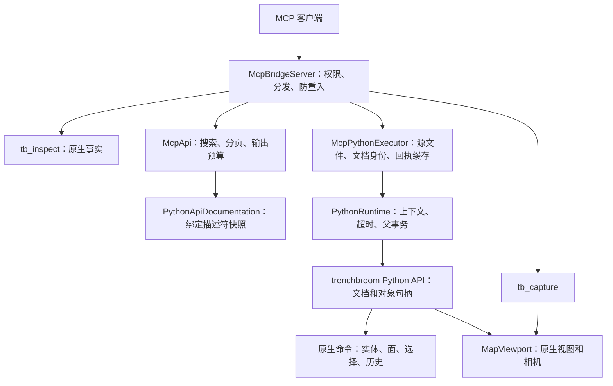

# MCP 架构与编辑边界

MCP 保留四个入口。传输、发现、执行和原生编辑分别由各自的模块负责：

## 对象与选择

实体和刷子句柄使用节点生命周期代次。属性编辑不改变对象身份，因此通过不同查询取得
的同一实体句柄可以连续读取、修改。删除子树使后代句柄失效；重新归属操作若移除节点，
也需要重新取得句柄。面的几何边界仍单独检查，文档关闭、重载继续检查文档代次。
材质和材质集合句柄通过所属文档按名称或路径重新解析，避免资源卸载后访问原来的裸指针。

实体属性使用 `updateNodeContents`；面属性使用接收明确面集合的
`setBrushFaceAttributes`。它们不改变选择，也不产生用于属性编辑的临时选择通知。
删除节点只取消被删除子树的节点和面选择，保留其他选择；父事务负责失败回滚和历史。

句柄访问先检查线程局部执行上下文，再检查 MCP 文档身份和生命周期。后台线程不能
直接访问缓存的编辑器句柄。文档 `id`、`path` 可用于识别另一文档；显式打开、激活
不会把本次执行的编辑目标切换过去。后续编辑必须重新 inspect，并使用新文档 guard。

## 发现与执行

`tb_api` 在原生模块注册后读取一次描述符，保存为 C++ 文档快照。后续查询不会执行
调用方 Python 或求值实例属性。签名包含实际参数名、默认值和返回类型，属性包含
`writable`；`effect` 在 API 目录中明确声明，不按函数名猜测。可变参数辅助函数在
绑定处补充允许的调用形式。控制台静态类型目录继续用于补全推断。

所有结果使用 `trenchbroom.` 限定名称；精确查询也接受省略该前缀或 `tb.` 简写。
搜索返回 `total`、`offset`、`limit`、`truncated` 和 `nextOffset`，默认 8 项，最多
50 项，单页不超过 16 KiB。旧 `parameters`、`returns` 和自动拼接的 `example`
字段移除；调用信息以实际 `signature` 为准。

绑定处手写的单位说明、字典结构和最小示例通过 `description` 返回，与真实签名分开。
例如 `Face.set_uv_loops` 使用纹理像素坐标；256×128 贴图的完整 UV 范围为
`(0,0)..(256,128)`。不从函数名自动推导示例或另建一份函数签名表。

## 问题检查

`tb_inspect(view="problems")` 默认 `detail="summary"`，只返回按原生 validator 名称
分类的计数。默认尊重编辑器中单独隐藏的问题和 Issue Browser 的类型过滤器；
`includeHidden=true` 可重新查看。节点隐藏与问题隐藏含义不同。

`ignoreTypes` 使用摘要中的精确类型名，例如 `Non-integer vertices`；只过滤本次
请求，不修改地图或原生问题隐藏状态。`types` 可进一步选择需要阅读的类型。
返回的 `totalCount` 是全部原生问题数，`hiddenCount`、`ignoredCount`、`filteredCount`
依次记录各步排除数量，`count` 是最终匹配数。忽略不表示已修复，不据此声称地图无问题。

`detail="issues"` 返回详情页，`limit` 默认 20、范围 1–100，`offset` 和 `nextOffset`
用于继续读取同一过滤条件下的结果。每页不超过 16 KiB，长描述标记
`messageTruncated`；异常长标识符明确标记 `idOmitted`，不返回可能被误用的截断 ID。
地图变化后应从第一页重新检查，不维护 MCP 专属问题缓存或隐藏状态。

`McpPythonExecutor` 管理执行源、请求去重和回执；读取脚本前检查大小，并限制实际
读取量。`PythonRuntime` 继续管理主线程执行、协作超时、结果转换及原生事务。
异常回执带有限 stdout/stderr 预览和丢弃字节数。

`executionId` 去除首尾空白后须为 1..256 个字符。去重缓存最多保留 1024 个请求身份、
16 MiB 序列化回执数据。达到字节上限时，丢弃
旧的大结果但保留其请求散列；重放返回 `receipt_expired`，不会再次执行编辑。身份
也因数量限制或服务重启而淘汰后，客户端必须结合当前地图判断，不能依赖无限期去重。
16 MiB 是序列化数据预算，不是进程实际内存占用上限。

## 视角与证据

`viewport.state()` 读取当前相机；`set_camera(position, target, up)` 和
`focus_selection()` 使用 action 模式，激活 3D 视图，停止旧相机动画并同步设置视角。
非法、重合或平行参数在视图改变前拒绝。它们不进入地图 undo 栈，失败回执通过
`completedActions` 如实报告已完成的视角操作。

`viewport.state()["options"]` 返回原生显示选项；action 模式下通过
`viewport.set_options({...})` 幂等地设置部分选项。布尔开关、贴图模式
`face_render_mode`（`textured/flat/skip`）和连线模式 `entity_link_mode`
（`all/transitive/direct/none`）均先验证整个输入再修改。选项复用共享的原生应用
偏好设置，只有 `show_grid` 属于当前文档；调用方可保存 options 字典并随后恢复。
不创建 MCP 专属渲染配置，2D 视图强制边线等原生渲染规则仍然适用。

截图仍由当前原生视口生成，回执包含文档路径、投影类型、位置、方向、up、zoom 和
视口大小。截图只证明渲染结果；BSP 编译、碰撞和游戏内路线仍需要对应验收。

## 回归范围

`McpPythonExecution` 覆盖完整分页、绑定元数据、实体连续编辑、面属性保留选择、
删除子树后剩余选择、undo/redo、后台和跨文档访问拒绝、同步相机动作及失败回执，
以及大结果淘汰后的安全重放。已有异常、超时、提交失败、断连和句柄回归继续运行。
交付还需构建 Release，运行受影响库和控制台/插件回归，并在一次性地图上完成
真实执行、回滚、历史与截图检查。

绑定文档机制参考 [pybind11 官方说明](https://pybind11.readthedocs.io/en/stable/basics.html)
及 [属性绑定说明](https://pybind11.readthedocs.io/en/stable/classes.html)，实际结果以
本分支 pybind11 3.0.1 生成的描述符和测试为准。
